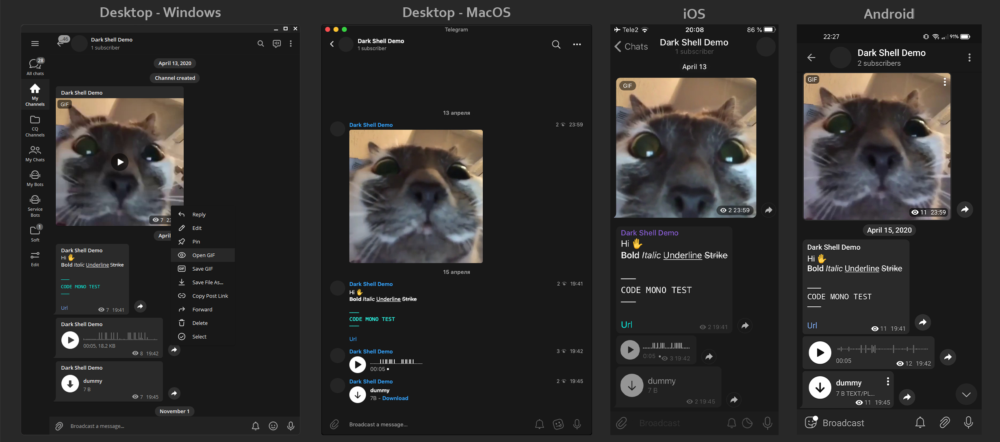

	<h1><b>Dark Shell</b></h1>
Telegram Theme 
	by <a href="https://github.com/maximilionus">@maximilionus</a><h>

    <b>Preview Screenshot</b>
    

# Main Information
- **Dark Shell** is a minimalistic dark mode theme for Telegram clients on Windows, Linux, macOS, iOS, Android.
- This repository contains all source files and releases for this theme.

# Installation
- [**Universal Link**][telegram-theme-shared-link] for any supported device ([device check](./README.md#Development-Status))
- **Windows / Linux** *(Manual Install)* :
  1. [Download The Latest Release][tdesktop-latest-release] or select version from [Versions Archive](./VERSIONS_ARCHIVE.md).
  2. Open Telegram.
  - *Using messages :*
	1. Send the downloaded file to `Saved messages`.
	2. Click on sent file and press `APPLY THIS THEME` button.
  - *Using settings :*
	1. Go to **Settings** -> **Chat Settings**.
	2. Press  -> `Create new theme` -> `IMPORT EXISTING THEME`.
	3. Find and choose downloaded `.tdesktop-theme` file.
- **macOS** *(Manual Install)* :
  1. [Download The Latest Release][macOS-latest-release] or select version from [Versions Archive](./VERSIONS_ARCHIVE.md).
  2. Open Telegram and go to `Settings` -> `Appearance`.
  3. Click on  in upper-right corner of app and press `New theme`.
  4. Name it **Dark Shell** *(Or how you want to)* and press `Create`. You'll be asked to save the theme file. Save it anywhere *(You can delete this file after that)*.
  5. RMB click on created theme and click `Edit` -> `Update from file`
  6. Find and choose downloaded `.palette` file.
- **iOS** *(Manual Install)* :
  1. [Download The Latest Release][iOS-latest-release] or select version from [Versions Archive](./VERSIONS_ARCHIVE.md).
  2. Send the downloaded file to `Saved messages`.
  3. Click on it.
  4. Press the `Set` button in bottom-right corner of the screen.
- **Android** *(Manual Install)* :
  1. [Download The Latest Release][android-latest-release] or select version from [Versions Archive](./VERSIONS_ARCHIVE.md).
  2. Send the downloaded file to `Saved messages`.
  3. Click on it.
  4. Press the `Apply` button in bottom-right corner of the screen.

	## How to download a specific version
	If you want to download a specific version of theme <ins>DON'T</ins> search for it in [Releases](https://github.com/maximilionus/Telegram-Dark-Shell/releases). Instead, go to the [Versions Archive](./VERSIONS_ARCHIVE.md) and you'll find a table with all versions and links to them.

# Development Status
| **Platform** | **Ready** | **Tested** | **Version** |
| :----------- | :-------- | :--------- | :---------- |
| Windows      | True      | True       | `1.1`       |
| Linux        | True      | False      | `1.1`       |
| macOS        | True      | False      | `1.0`       |
| iOS          | True      | True       | `1.1`       |
| Android      | True      | False      | `2.0`       |

> If you have tested this theme on non-tested platforms, please [let me know about it](https://github.com/maximilionus/Telegram-Dark-Shell/issues/new?labels=platform-tested)

<!-- REFERENCE LINKS -->
[telegram-theme-shared-link]: https://t.me/addtheme/DarkShell (Telegram Theme Shared Link)
[tdesktop-latest-release]: https://github.com/maximilionus/Telegram-Dark-Shell/releases/latest/download/DarkShell.tdesktop-theme (Download the latest release for Windows / Linux)
[macOS-latest-release]: https://github.com/maximilionus/Telegram-Dark-Shell/releases/latest/download/DarkShell.palette (Download the latest release for macOS)
[iOS-latest-release]: https://github.com/maximilionus/Telegram-Dark-Shell/releases/latest/download/DarkShell.tgios-theme (Download the latest release for iOS)
[android-latest-release]: https://github.com/maximilionus/Telegram-Dark-Shell/releases/latest/download/DarkShell.attheme (Download the latest release for Android)
