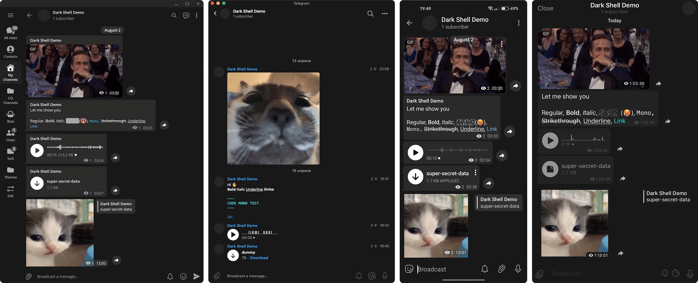

	<h1><b>Dark Shell</b></h1>
Telegram Theme 
	by <a href="https://github.com/maximilionus">@maximilionus</a> and <a href="#contributors">contributors</a><h>

---

# About
**Dark Shell** is a minimalistic dark theme for Telegram clients on Windows, Linux, macOS, iOS and Android platforms. This repository contains all source files and releases for this theme.

# Installation
## Universal
- [**Click to install** ☁️][telegram-theme-shared-link] this theme on any supported device *([list](./README.md#Development-Status))* with automatic updates feature
> All new stable features and changes will be delivered much faster and will not be bound to releases

## Manual Install

<b>&emsp;Windows / Linux</b>

1. [Download The Latest Release][tdesktop-latest-release] or select version from [Versions Archive](./VERSIONS_ARCHIVE.md).
2. Open Telegram.
- *Using messages :*
   1. Send the downloaded file to `Saved messages`.
   2. Click on sent file and press `APPLY THIS THEME` button.
- *Using settings :*
  1. Go to **Settings** -> **Chat Settings**.
  2. Press  -> `Create new theme` -> `IMPORT EXISTING THEME`.
  3. Find and choose downloaded `.tdesktop-theme` file.

&emsp;<b>macOS</b>

1. [Download The Latest Release][macOS-latest-release] or select version from [Versions Archive](./VERSIONS_ARCHIVE.md).
2. Open Telegram and go to `Settings` -> `Appearance`.
3. Press  in upper-right corner of app and press `New theme`.
4. Name it **Dark Shell** *(Or how you want to)* and press `Create`. You'll be asked to save the theme file. Save it anywhere *(You can delete this file after that)*.
5. <kbd>RMB</kbd> click on created theme and click `Edit` -> `Update from file`
6. Find and choose downloaded `.palette` file.

&emsp;<b>iOS</b>

1. [Download The Latest Release][iOS-latest-release] or select version from [Versions Archive](./VERSIONS_ARCHIVE.md).
2. Send the downloaded file to `Saved messages`.
3. Click on it.
4. Press the `Set` button in bottom-right corner of the screen.

&emsp;<b>Android</b>

1. [Download The Latest Release][android-latest-release] or select version from [Versions Archive](./VERSIONS_ARCHIVE.md).
2. Send the downloaded file to `Saved messages`.
3. Click on it.
4. Press the `Apply` button in bottom-right corner of the screen.

## Download specific version
If you want to download a specific version of this theme <ins>DO NOT</ins> search for it in [Releases](https://github.com/maximilionus/Telegram-Dark-Shell/releases). Instead, go to the [Versions Archive](./VERSIONS_ARCHIVE.md) where you'll find a table containing all versions of this theme along with their respective download links.

# Development Status
| Platform                | Version | Tested | Client  |
| :---------------------- | :-----: | :----: | :-----: |
| **Windows** / **Linux** | `2.4` | Yes | `4.8.1` |
| **macOS**               | `1.0` | Yes | `10.6.1` |
| **iOS**                 | `3.0` | Yes | `9.6.1` |
| **Android**             | `4.4` | Yes | `9.6.2` |

# Contributors
I am grateful to all the people who have made a contribution of any size to this project. **Thank you**!

- [@kirizdev](https://github.com/kirizdev)

<!-- REFERENCE LINKS -->
[telegram-theme-shared-link]: https://t.me/addtheme/DarkShell (Telegram Theme Shared Link)
[tdesktop-latest-release]: https://github.com/maximilionus/Telegram-Dark-Shell/releases/latest/download/DarkShell.tdesktop-theme (Download the latest release for Windows / Linux)
[macOS-latest-release]: https://github.com/maximilionus/Telegram-Dark-Shell/releases/latest/download/DarkShell.palette (Download the latest release for macOS)
[iOS-latest-release]: https://github.com/maximilionus/Telegram-Dark-Shell/releases/latest/download/DarkShell.tgios-theme (Download the latest release for iOS)
[android-latest-release]: https://github.com/maximilionus/Telegram-Dark-Shell/releases/latest/download/DarkShell.attheme (Download the latest release for Android)
